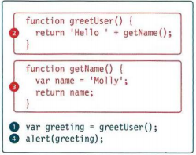
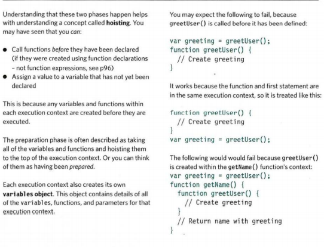
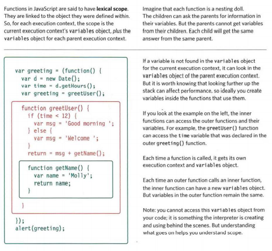
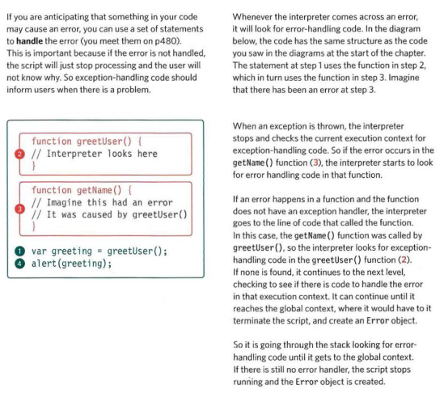
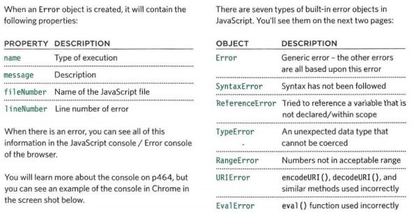
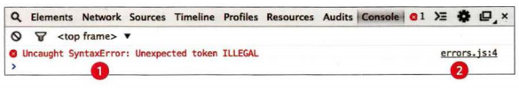
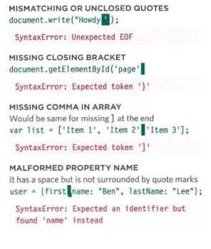
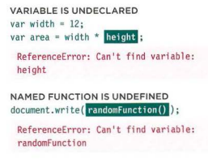

# Error Handling and Debugging in Javascript

When writing a long script, nobody gets everything right in their first attempt.  The error
messages that a browser gives look cryptic at first, but they can help you determine what
went wrong in your JavaScript and how to fix it. 

**THE CONSOLE & DEV TOOLS**

Tools built into the browser that help you hunt for errors. 

**Common Problems**

Common sources of errors, and how to solve them. 

**Handling Errors**

How code can deal with potential errors gracefully. 

**Order Of Execution**

=It helps to know how scripts are processed.

The order in which statements are executed can be complex; some tasks
cannot complete until another statement or function has been run.

Ex:

**Execution Contexts**

The JavaScript interpreter uses the concept of execution contexts. There is one global execution context; plus, each function creates a new new execution context. They correspond to variable scope. 

- Every statement in a script lives in one of three execution contexts:  

1- Global Context.

Code that is in the script, but not in a function.

There is only one global context in any page. 

2- Function Context

Code that is being run within a function.

Each function has its own function context. 

3- Eval Context

Text is executed like code in an internal function called eval {) 

- The first two execution contexts correspond with the notion of scope:

1- Global Scope

If a variable is declared outside a function, it can be used anywhere because it has global scope.

Note: If you do not use the var keyword when creating a variable, it is placed in global scope. 

2- Function-Level Scope

When a variable is declared within a function, it can only be used within that function.
This is because it has function-level scope. 

**The Stack**

The JS interpreter processes one line of code at a time. When a statement needs data from another function, it stacks the new function on top of the current task.

**Executing Context & Hosting**

Each time a script enters a new execution context, there are two phases of activity:

1- Prepare

- The new scope is created

- Variables, functions, and arguments are created

- The value of the this keyword is determined 

2- Execute

- Now it can assign values to variables 

- Reference functions and run their code 

- Execute statements 

**Scopes**

In the interpreter, each execution context has its own va ri ables object. 
It holds the variables, functions, and parameters available within it.
Each execution context can also access its parent's v a ri ables object. 

**Errors**
If a JavaScript statement generates an error, then it throws an exception.
At that point, the interpreter stops and looks for exception-handl ing code. 

**Error Objects**

Error objects can help you find where your mistakes are and browsers have tools to help you read them. 

Ex:

Note: These error messages are from the Chrome browser. Other browsers' error messages may vary.

- Syntax Error (Syntax is not correct)

This is caused by incorrect use of the rules of the language. 

Examples:

- Reference Error (Variable deosn't exist)

This is caused by a variable that is not declared or is out of scope. 

Examples:

