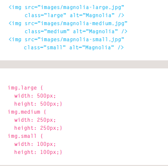
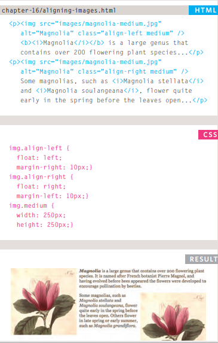
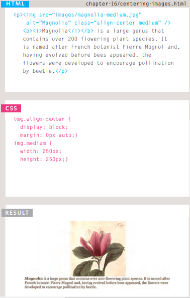
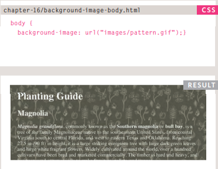
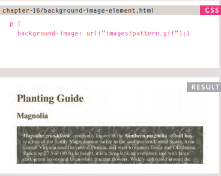
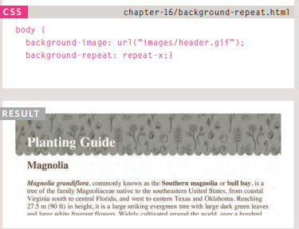

# Images in HTML

### Controlling Sizes Of Images In CSS

You can control the size of an image using the width and height properties in CSS.

Below you find how we specify the width and height of images:

**What is the purpose of specifiying images sizes?**

Specifying image sizes helps pages to load more smoothly because the HTML and CSS code will often load before the images, and telling the browser how much space to leave for an image allows it to render the rest of the page without waiting for the image to download.

### Aligning Images Using CSS

web page authors are increasingly using the float property to align images. 

Example:

### Centering Images Using CSS

1. By default, images are inline elements. This means that they low within the surrounding text. In order to center an image, it should be turned into a blocklevel element using the display property with a value of block. 

2. Once it has been made into a block-level element, there are two common ways in which you can horizontally center an image:

- On the containing element, you can use the text-align property with a value of center.

- On the image itself, you can use the use the margin property and set the values of the left and right margins to auto.

Example:

### Background Images

The background-image property allows you to place an image behind any HTMLelement. This could be the entire page or just part of the page. By default, a background image will repeat to fill the entire box.

The path to the image follows the letters url, and it is put inside parentheses and quotes.

Examples:

**What about repeating images?**

1. repeat: The background image is repeated both horizontally and vertically (the default way it is shown if the backgroundrepeat property isn't used).

2. repeat-x: The image is repeated horizontally only.

Example:

3. repeat-y: The image is repeated vertically only.

4. no-repeat: The image is only shown once

**What if the user want to scroll up and down?**

we use the **background-attachment** property to specify whether a background image should stay in one position or move as the user scrolls up and down the page.

It can have one of two values:

1. fixed: The background image stays in the same position on the page.

Example:

2. scroll: The background image moves up and down as the user scrolls up and down the page.

**Background position**

When an image is not being repeated, you can use the background-position property to specify where in the browser window the background image should be placed. 

This property usually has a pair of values. The first represents the horizontal position and the second represents the vertical.

If you only specify one value, the second value will default to center.

Example:

**Shorthand Background**

1. background-color

2. background-image

3. background-repeat

4. background-attachment

5. background-position

### Images Rollovers & Spirits

