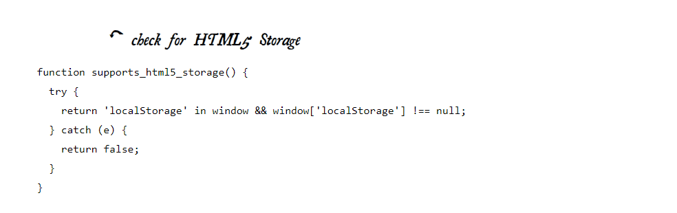

# Local Storage

### LOCAL STORAGE HACKS BEFORE HTML5

In the beginning, there was only Internet Explorer. Or at least, that’s what Microsoft wanted the world to think. To that end, as part of the First Great Browser Wars, Microsoft invented a great many things and included them in their browser-to-end-all-browser-wars, Internet Explorer. One of these things was called **DHTML Behaviors**, and one of these behaviors was called **userData**.

**User data** allows web pages to store up to 64 KB of data per domain, in a hierarchical XML-based structure. (Trusted domains, such as intranet sites, can store 10 times that amount. And hey, 640 KB ought to be enough for anybody.) IE does not present any form of permissions dialog, and there is no allowance for increasing the amount of storage available.

### INTRODUCING HTML5 STORAGE

What I will refer to as “HTML5 Storage” is a specification named Web Storage, which was at one time part of the HTML5 specification proper, but was split out into its own specification for uninteresting political reasons. Certain browser vendors also refer to it as “Local Storage” or “DOM Storage.”

**What is HTML5 Storage?**

 it’s a way for web pages to store named key/value pairs locally, within the client web browser.
 
 **Like cookies:** this data persists even after you navigate away from the web site, close your browser tab, exit your browser, or what have you.
 
 **Unlike cookies:** this data is never transmitted to the remote web server (unless you go out of your way to send it manually).
 
Unlike all previous attempts at providing persistent local storage, it is implemented natively in web browsers, so it is available even when third-party browser plugins are not.
 
Which browsers? Well, the latest version of pretty much every browser supports HTML5 Storage… even Internet Explorer!


From your JavaScript code, you’ll access HTML5 Storage through the localStorage object on the global window object. Before you can use it, you should detect whether the browser supports it.



Instead of writing this function yourself, you can use Modernizr to detect support for HTML5 Storage.

```
if (Modernizr.localstorage) {
  // window.localStorage is available!
} else {
  // no native support for HTML5 storage :(
  // maybe try dojox.storage or a third-party solution
}
```

### USING HTML5 STORAGE

HTML5 Storage is based on named key/value pairs. You store data based on a named key, then you can retrieve that data with the same key. The named key is a string. The data can be any type supported by JavaScript, including strings, Booleans, integers, or floats. However, the data is actually stored as a string. If you are storing and retrieving anything other than strings, you will need to use functions like parseInt() or parseFloat() to coerce your retrieved data into the expected JavaScript datatype.

```
interface Storage {
  getter any getItem(in DOMString key);
  setter creator void setItem(in DOMString key, in any data);
};
```

Calling setItem() with a named key that already exists will silently overwrite the previous value. Calling getItem() with a non-existent key will return null rather than throw an exception.

Like other JavaScript objects, you can treat the localStorage object as an associative array. Instead of using the getItem() and setItem() methods, you can simply use square brackets. 

Example:

```
var foo = localStorage.getItem("bar");
// ...
localStorage.setItem("bar", foo);
```

Could be rewritten to use square bracket syntax instead:

```
var foo = localStorage["bar"];
// ...
localStorage["bar"] = foo;
```

There are also methods for removing the value for a given named key, and clearing the entire storage area (that is, deleting all the keys and values at once).

```
interface Storage {
  deleter void removeItem(in DOMString key);
  void clear();
};
```

Calling removeItem() with a non-existent key will do nothing.

Finally, there is a property to get the total number of values in the storage area, and to iterate through all of the keys by index (to get the name of each key).

```
interface Storage {
  readonly attribute unsigned long length;
  getter DOMString key(in unsigned long index);
};
```

If you call key() with an index that is not between 0–(length-1), the function will return null.


