# CSS Transforms, Transitions, and Animations

### Transforms

With CSS3 came new ways to position and alter elements. Now general layout techniques can be revisited with alternative ways to size, position, and change elements. All of these new techniques are made possible by the transform property.

The transform property comes in two different settings, two-dimensional and three-dimensional. Each of these come with their own individual properties and values.

##### Transform Syntax

The actual syntax for the transform property is quite simple, including the transform property followed by the value. The value specifies the transform type followed by a specific amount inside parentheses.

```
div {
  -webkit-transform: scale(1.5);
     -moz-transform: scale(1.5);
       -o-transform: scale(1.5);
          transform: scale(1.5);
}
```

Notice how the transform property includes multiple vendor prefixes to gain the best support across all browsers. The un-prefixed declaration comes last to overwrite the prefixed versions, should a browser fully support the transform property.

**2D Transforms:**  Two-dimensional transforms work on the x and y axes, known as horizontal and vertical axes.

- 2D Rotate

The transform property accepts a handful of different values. The rotate value provides the ability to rotate an element from 0 to 360 degrees. Using a positive value will rotate an element clockwise, and using a negative value will rotate the element counterclockwise. The default point of rotation is the center of the element, 50% 50%, both horizontally and vertically.

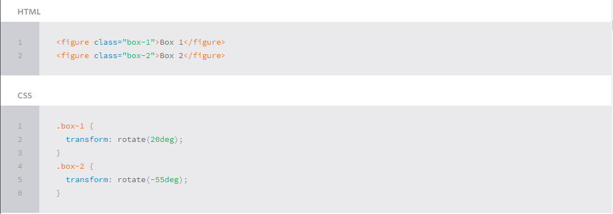

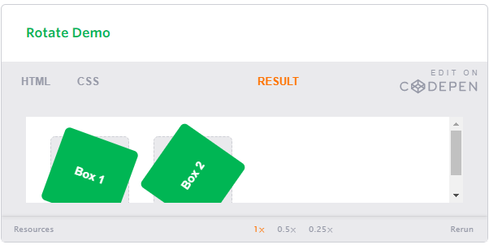

- 2D Scale

Using the scale value within the transform property allows you to change the appeared size of an element. The default scale value is 1, therefore any value between .99 and .01 makes an element appear smaller while any value greater than or equal to 1.01 makes an element appear larger.

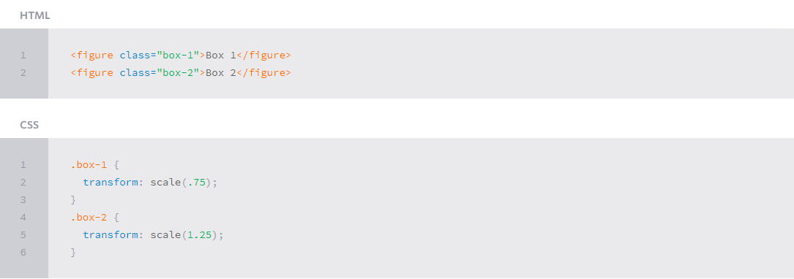

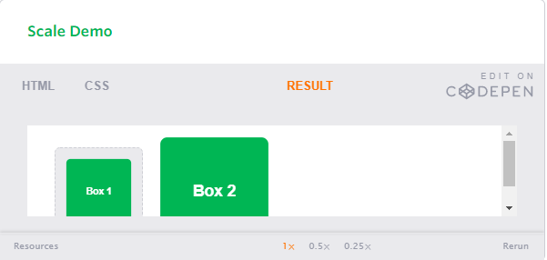

It is possible to scale only the height or width of an element using the scaleX and scaleY values. The scaleX value will scale the width of an element while the scaleY value will scale the height of an element. To scale both the height and width of an element but at different sizes, the x and y axis values may be set simultaneously. To do so, use the scale transform declaring the x axis value first, followed by a comma, and then the y axis value.

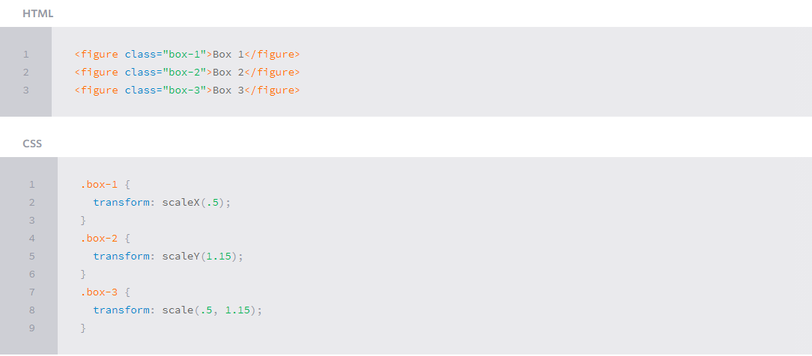

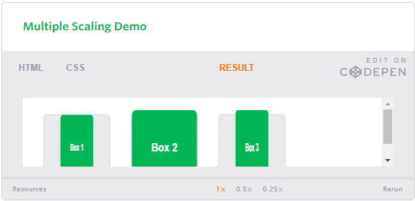

- 2D Translate

The translate value works a bit like that of relative positioning, pushing and pulling an element in different directions without interrupting the normal flow of the document. Using the translateX value will change the position of an element on the horizontal axis while using the translateY value will change the position of an element on the vertical axis.

As with the scale value, to set both the x and y axis values at once, use the translate value and declare the x axis value first, followed by a comma, and then the y axis value.

The distance values used within the translate value may be any general length measurement, most commonly pixels or percentages. Positive values will push an element down and to the right of its default position while negative values will pull an element up and to the left of its default position.

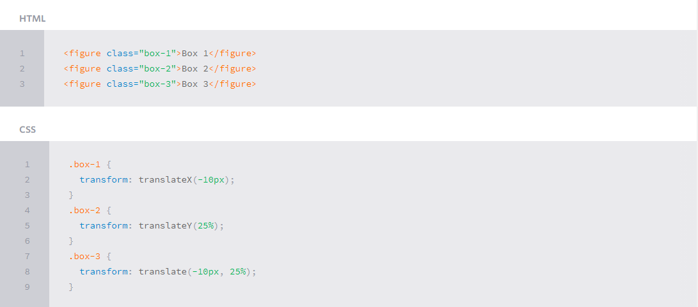

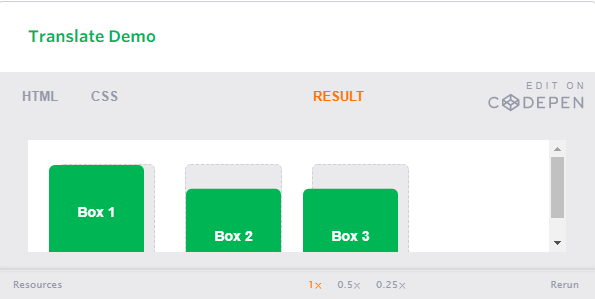

- 2D Skew

The last transform value in the group, skew, is used to distort elements on the horizontal axis, vertical axis, or both. The syntax is very similar to that of the scale and translate values. Using the skewX value distorts an element on the horizontal axis while the skewY value distorts an element on the vertical axis. To distort an element on both axes the skew value is used, declaring the x axis value first, followed by a comma, and then the y axis value.

The distance calculation of the skew value is measured in units of degrees. Length measurements, such as pixels or percentages, do not apply here.

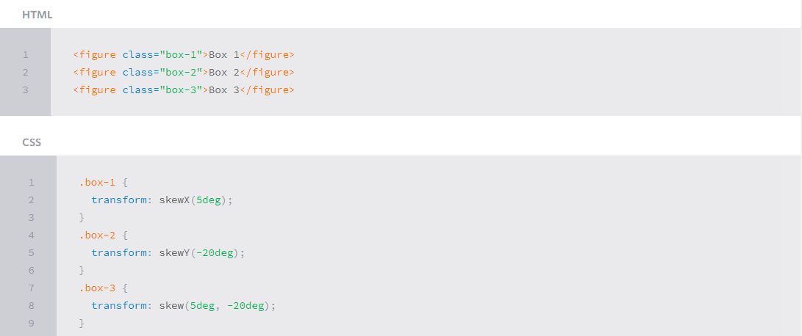

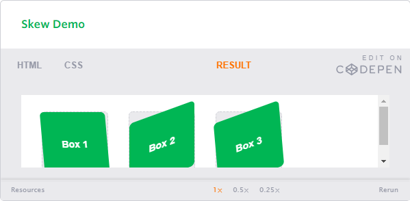

- Combining Transforms

It is common for multiple transforms to be used at once, rotating and scaling the size of an element at the same time for example. In this event multiple transforms can be combined together. To combine transforms, list the transform values within the transform property one after the other without the use of commas.

Using multiple transform declarations will not work, as each declaration will overwrite the one above it. The behavior in that case would be the same as if you were to set the height of an element numerous times.

```
<figure class="box-1">Box 1</figure>
<figure class="box-2">Box 2</figure>
```

```
.box-1 {
  transform: rotate(25deg) scale(.75);
}
.box-2 {
  transform: skew(10deg, 20deg) translateX(20px);
}
````

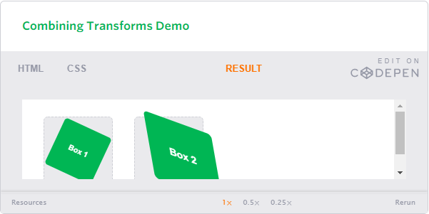

Example:

HTML:

```
<div class="cube">
  <figure class="side top">1</figure>
  <figure class="side left">2</figure>
  <figure class="side right">3</figure>
</div>
```

CSS:
```
.cube {
  position: relative;
}
.side {
  height: 95px;
  position: absolute;
  width: 95px;
}
.top {
  background: #9acc53;
  transform: rotate(-45deg) skew(15deg, 15deg);
}
.left {
  background: #8ec63f;
  transform: rotate(15deg) skew(15deg, 15deg) translate(-50%, 100%);
}
.right {
  background: #80b239;
  transform: rotate(-15deg) skew(-15deg, -15deg) translate(50%, 100%);
}
```

The Result:

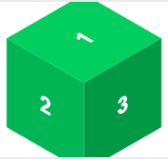

- Transform Origin#transform-origin

As previously mentioned, the default transform origin is the dead center of an element, both 50% horizontally and 50% vertically. To change this default origin position the transform-origin property may be used.

The transform-origin property can accept one or two values. When only one value is specified, that value is used for both the horizontal and vertical axes. If two values are specified, the first is used for the horizontal axis and the second is used for the vertical axis.

Individually the values are treated like that of a background image position, using either a length or keyword value. That said, 0 0 is the same value as top left, and 100% 100% is the same value as bottom right. More specific values can also be set, for example 20px 50px would set the origin to 20 pixels across and 50 pixels down the element.

HTML:
```
<figure class="box-1">Box 1</figure>
<figure class="box-2">Box 2</figure>
<figure class="box-3">Box 3</figure>
<figure class="box-4">Box 3</figure>
```

CSS:

```
.box-1 {
  transform: rotate(15deg);
  transform-origin: 0 0;
}
.box-2 {
  transform: scale(.5);
  transform-origin: 100% 100%;
}
.box-3 {
  transform: skewX(20deg);
  transform-origin: top left;
}
.box-4 {
  transform: scale(.75) translate(-10px, -10px);
  transform-origin: 20px 50px;
}
```

Result:

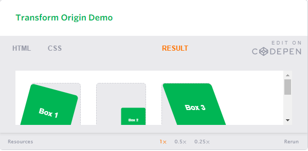


